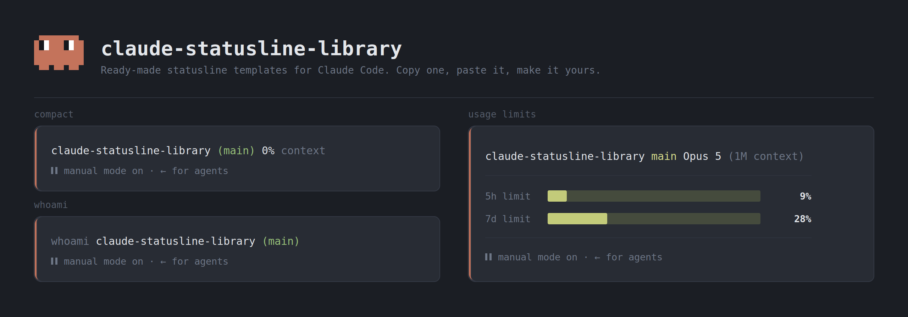

# Claude Code Statusline Library



A public, community-driven collection of [status line](https://code.claude.com/docs/en/statusline) templates for [Claude Code](https://claude.com/claude-code).

Grab one, drop it in your config, done. Or contribute your own.

## Install

The installer copies a template to `~/.claude/statusline.sh` and points your `settings.json` at it. It shows a preview and asks before writing anything.

```bash
# Interactive picker
curl -fsSL https://raw.githubusercontent.com/Edgaraszs/claude-statusline-library/main/install.sh | bash

# Or install a specific template straight away
curl -fsSL https://raw.githubusercontent.com/Edgaraszs/claude-statusline-library/main/install.sh | bash -s -- rate-limit
```

From a clone:

```bash
./install.sh                 # interactive picker
./install.sh rate-limit      # by name
./install.sh --list          # see what's available
```

| Option | What it does |
| --- | --- |
| `-l`, `--list` | List templates and exit. |
| `-t`, `--target PATH` | Where to write the script (default `~/.claude/statusline.sh`). |
| `-s`, `--settings PATH` | Which `settings.json` to update (default `~/.claude/settings.json`). |
| `--no-settings` | Copy the script, leave `settings.json` alone. |
| `-y`, `--yes` | Don't prompt. |

## Manual usage

1. Pick a template from [`templates/`](templates/).
2. Copy its script somewhere stable, e.g. `~/.claude/statusline.sh`:

   ```bash
   cp templates/user-dir-branch/statusline.sh ~/.claude/statusline.sh
   chmod +x ~/.claude/statusline.sh
   ```

3. Point your `~/.claude/settings.json` at it:

   ```json
   {
     "statusLine": {
       "type": "command",
       "command": "~/.claude/statusline.sh"
     }
   }
   ```

4. Restart Claude Code.

## Templates

| Template | Description |
| --- | --- |
| [`user-dir-branch`](templates/user-dir-branch/) | Username, current directory (`~` for home), and git branch — a zsh-style prompt. |
| [`dir-branch-context`](templates/dir-branch-context/) | Current directory, git branch, and context window usage percentage. |
| [`rate-limit`](templates/rate-limit/) | Current directory, git branch, model, and multi-line 5h / 7d rate limit bars with color thresholds. |

## Contributing

New templates welcome.

1. Create `templates/<your-template-name>/`.
2. Add `statusline.sh` (or a script in any language — just make it executable and self-contained).
3. Add a short `README.md` in the folder: what it shows, a screenshot or sample output, and any dependencies.
4. Add a row to the table above.
5. Add a `name|description` line to `TEMPLATE_META` in [`install.sh`](install.sh) so the installer can offer it remotely.
6. Open a pull request.

### Guidelines

- Keep it fast. The status line runs often; avoid slow network calls.
- Declare dependencies (`jq`, `git`, nerd fonts, etc.).
- Fail quietly. Never let a missing tool break the status line — guard with `2>/dev/null` and fallbacks.
- Use `git -C "$cwd" --no-optional-locks` so you don't fight the user's git index.
- Exit `0`.

## License

MIT
